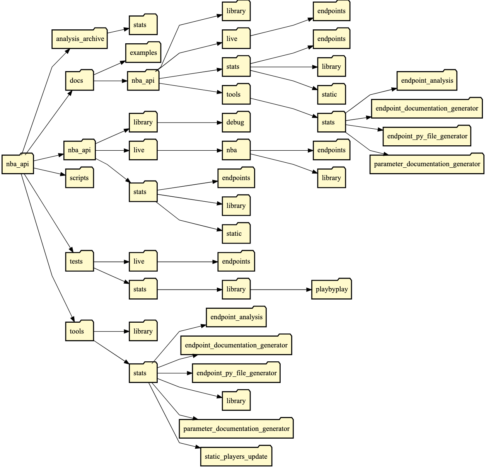

##### finding all active players
- from nba_api.stats.static import players
- players.get_active_players()
```JSON
    player = {
        'id': player_id,
        'full_name': full_name,
        'first_name': first_name,
        'last_name': last_name,
        'is_active': True or False
    }
``` 

##### Find every game a player has ever played
```python
gamefinder = leaguegamefinder.LeagueGameFinder(
    player_or_team_abbreviation="P",
    player_id_nullable=player_id,
    season_type_nullable=regular,
    season_nullable="2019-20"
)   
```

##### Get a list of games only within the last 5 seasons


#### BoxScore for a particular game
##### nba_api -> live -> endpoints
- [BoxScore](https://github.com/swar/nba_api/blob/master/docs/nba_api/live/endpoints/boxscore.md)


###### nba_api -> stats -> endpoints
- [CumeStatsPlayerGames](https://github.com/swar/nba_api/blob/master/docs/nba_api/stats/endpoints/cumestatsplayergames.md)
- [LeagueGameFinder](https://github.com/swar/nba_api/blob/master/docs/nba_api/stats/endpoints/leaguegamefinder.md)
can be used to retrieve every game a player has played 
    ```python
    gamefinder = leaguegamefinder.LeagueGameFinder(
        player_or_team_abbreviation="P",
        player_id_nullable=player_id
    )   
    ```


.get_data_frames() 
- helper function provided by the API